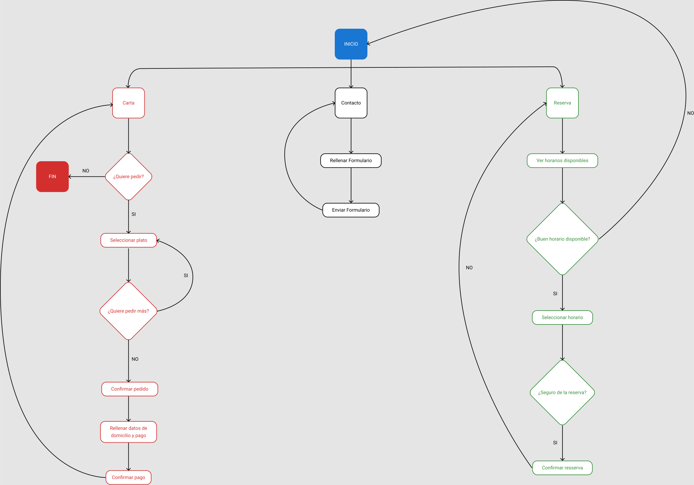
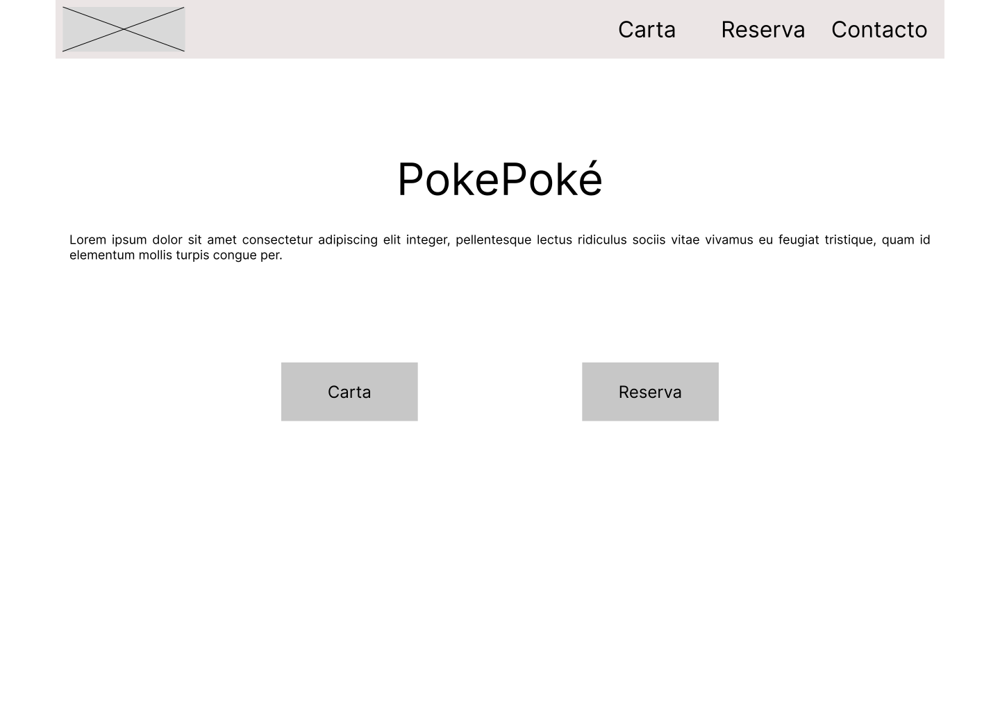
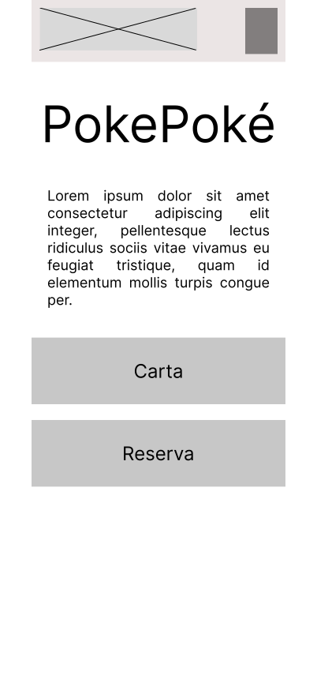
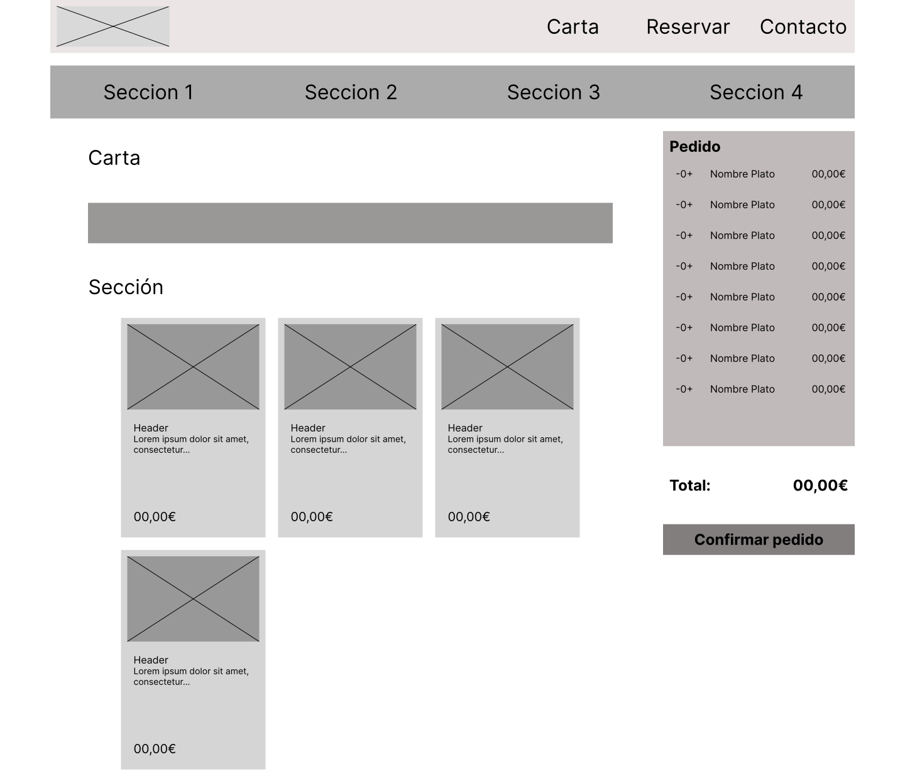
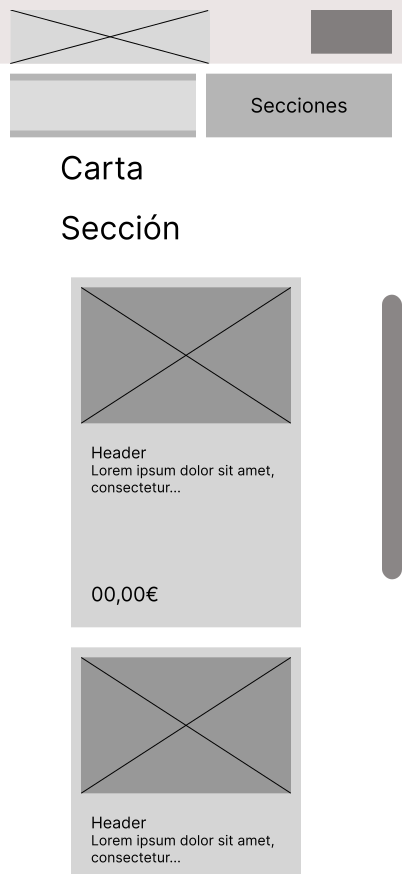
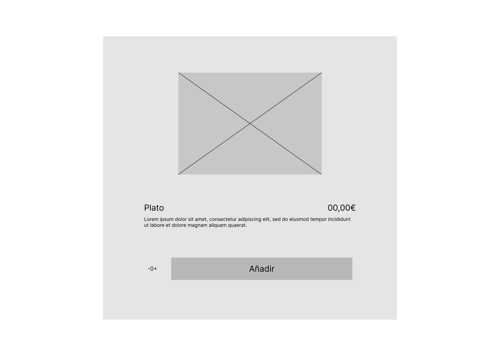

# DIU - Practica2, entregables

## Ideación 

### Mapa de empatía

### Malla receptora de información

Tras analizar los perfiles de Mía y María con sus mapas de empatía hemos detectado diferencias importantes en los intereses de cada una. Mientras que a Mía le interesa el anime y la cultura japonesa, y busca un restaurante para acercarse a esta cultura, a María no le interesan especialmente estas cosas, siendo sus hijos los que la convencen de ir a un restaurante japonés.

Aunque la competencia (Animeramen) ofrece en general una buena experiencia, hay cuestiones en su página web que son mejorables, como la falta de reserva online para algunos de los locales, la dificultad para ver los detalles de los platos y la navegación a veces poco estándar.

A partir de aquí, nos proponemos mejorar la accesibilidad de nuestra página y hacerla más intuitiva, adaptándola tanto a personas interesadas en el anime y la cultura pop japonesa como a las que no lo están.

### Point of View 

## PROPUESTA DE VALOR
Nuestro proyecto tiene como objetivo hacer de la experiencia que es visitar la web de un restaurante algo lo más sencillo posible, para así poder llegar a todo tipo de clientes.
### ScopeCanvas

## TASK ANALYSIS

### User/Task flow

Las tareas principales que va a hacer un usuario en nuestra página serán ver la carta, pedir comida, reservar mesa y contactar con el restaurante. Para ver la carta basta con entrar en la sección correspondiente. Desde ahí, se podrán seleccionar platos para pedir, tras lo cual se podrá confirmar el pedido. Las reservas se harán seleccionando un horario de entre los disponibles. El contacto se podrá hacer a través de un formulario, o a través de los canales de comunicación que estarán enlazados en la página.

## ARQUITECTURA DE INFORMACIÓN

### Sitemap 

El sitemap es un esquema visual que muestra cómo se estructura la web: qué páginas existen, cómo se relacionan entre sí y qué elementos son comunes en toda la plataforma (como el navbar o el footer). Nos ayuda a tener una visión global de la navegación y a asegurarnos de que todo está bien conectado. Para crearlo hemos utilizado la herramienta FlowMapp.

### Labelling 

| Término                         | Significado                                                                 |
|----------------------------------|------------------------------------------------------------------------------|
| Página de Inicio                | Punto de entrada a la web con acceso a las principales funcionalidades e información básica del restaurante y su ubicación. |
| Carta (Menú)                    | Página que muestra todos los platos disponibles, con opciones de filtrado y búsqueda. |
| Carrito                         | Sección visible donde se almacenan los platos seleccionados por el usuario. |
| Proceso de Pedido               | Página de confirmación donde el usuario revisa su pedido, introduce sus datos (como teléfono) y realiza el pago. |
| Plato (Ventana modal / Popup)   | Ventana emergente que aparece al seleccionar un plato, mostrando información detallada, ingredientes e imágenes. |
| Contacto                        | Página con un formulario que permite al usuario comunicarse con el restaurante. |
| Reserva                         | Página que permite seleccionar fecha y hora disponibles y completar los datos necesarios para realizar una reserva. |

Por otro lado, el labelling consiste en definir los nombres que daremos a cada sección o elemento del sitio. Cada término va acompañado de una pequeña explicación sobre su función.

## Prototipo Lo-FI Wireframe 

Como parte del proceso de diseño centrado en el usuario, se han creado varios wireframes que simulan la estructura visual de las pantallas principales de la web. Estos bocetos permiten definir la jerarquía de los elementos, la distribución de las secciones y la funcionalidad sin entrar en detalle.
Se ha utilizado la herramienta de Figma para crear los wireframes.
Cada uno de los wireframes creados tienen como objetivo mejorar la experiencia del usuario, a través de la corrección y mejora de la web estudiada en las secciones anteriores.

### Inicio

### ADAPTACIONES DE LA PÁGINA DE RESERVAS A LOS DISTINTOS DISPOSITIVOS(RESPONSIVE):

### ADAPTACIONES DE LA PÁGINA DE CONTACTO A LOS DISTINTOS DISPOSITIVOS(RESPONSIVE):

### Carta

### Plato

