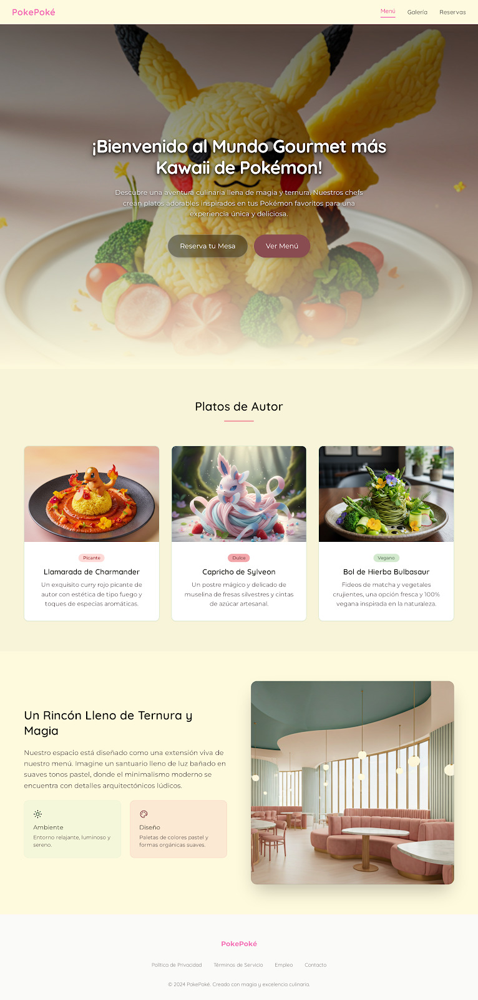

# DIU - Practica 3, entregables

## Moodboard

## Landing Page
Nuestra landing page se divide en tres partes: 

- El inicio, que es la parte más importante, conteniendo el menú de navegación, título y subtítulo (con una imagen por detrás), y las dos acciones principales, que son reservar y ver la carta.
- Algunos ejemplos de platos, con sus imágenes.
- Características del restaurante.

Para hacerla hemos usado Google Stich. Le pasamos las imágenes del moodboard y le dijimos que hiciera la landing page a partir de eso. Al hacerla, era demasiado larga, así que le pedimos que la acortara. Además, puso parte del texto en inglés, así que le hicimos cambiarlo a español. Por último, el subtítulo tenía muy poco contraste, por lo que hicimos que lo subiera.

## Mockup

- Moodboard (diseño visual + logotipo)   
- Landing Page
- Mockup: LAYOUT HI-FI
- Publicación del Case Study

## Conclusiones

>>>> Este fichero se debe editar para que cada evidencia quede enlazada con el recurso subido a la carpeta de la practica. Se pide más detalle técnico en las descripciones de lo que sería el README principal del repositorio y que corresponde a la descripcion del Case Study.
>>>> Termine con la seccion de Conclusiones para aportar una valoración final del equipo sobre la propia realización de la práctica
