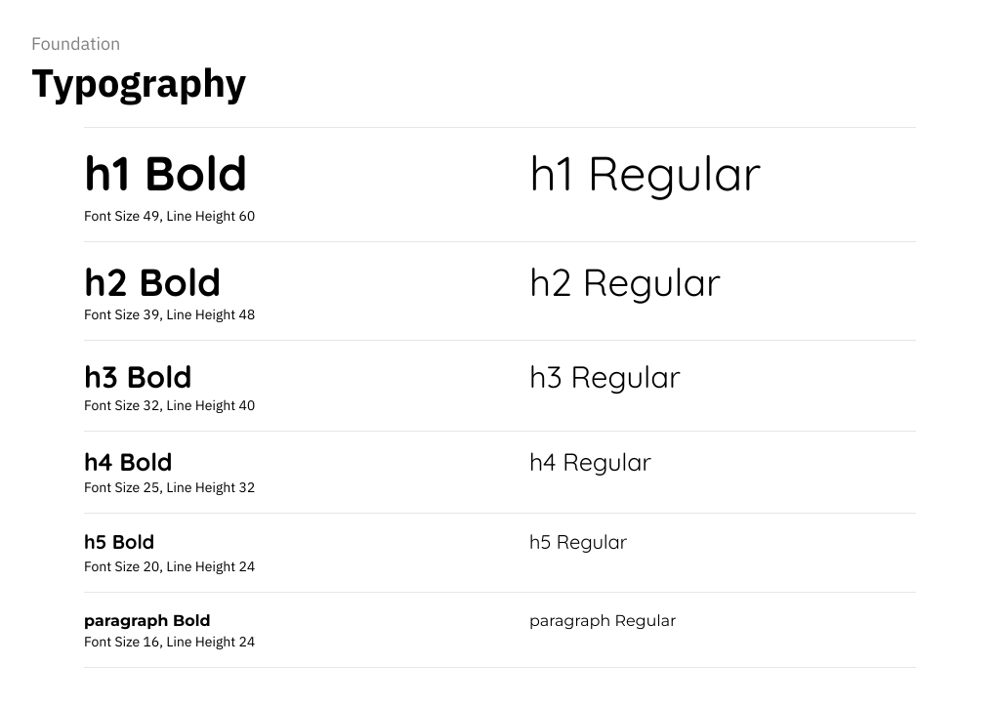

# DIU - Practica 3, entregables

**Enlace del prototipo:** https://www.figma.com/proto/wTqAyZ7qD5dY66dDGsYn63/Moodboard-PokePok%C3%A9--Copia-?node-id=14056-531&t=NTUG9kID3OMcTaOQ-1&starting-point-node-id=14056%3A531

## Moodboard
El moodboard de Poke Poké recoge los principales elementos visuales del proyecto: logotipo, paleta de colores, tipografía, imagenes de inspiración y perfil de usuario. Tanto el logo como las imagenes han sido generadas por Google Stitch, para generar imagenes estéticamente similares para que encajen en el diseño de la página. Se ha utilizado la plantilla disponible en el espacio de la asignatura en Figma, lo que ha permitido estructurar de forma clara y coherente los elementos visuales.

## Landing Page
Nuestra landing page se divide en tres partes: 

- El inicio, que es la parte más importante, conteniendo el menú de navegación, título y subtítulo (con una imagen por detrás), y las dos acciones principales, que son reservar y ver la carta.
- Algunos ejemplos de platos, con sus imágenes.
- Características del restaurante.

Para hacerla hemos usado Google Stich. Le pasamos las imágenes del moodboard y le dijimos que hiciera la landing page a partir de eso. Al hacerla, era demasiado larga, así que le pedimos que la acortara. Además, puso parte del texto en inglés, así que le hicimos cambiarlo a español. Por último, el subtítulo tenía muy poco contraste, por lo que hicimos que lo subiera.

## Design System
Para crear el design system de nuestro proyecto, hemos usado tanto la plantilla [Design System Foundation (Community)](https://www.figma.com/es-es/comunidad/file/1007839545438281461/design-system-foundation), de la que usamos varios componentes (después de adaptarlos), como el plugin [Foundation Studio | Design System Generator](https://www.figma.com/community/plugin/1576397531447817254/foundation-studio-design-system-generator), que usamos para generar la paleta de colores y la arquitectura tipográfica.

### Átomos
Además de adaptar los átomos de la plantilla con nuestros colores y tipos de letra, hemos añadido un componente donde se puede especificar la imagen de un plato, y una scrollbar para indicar cuándo es posible el desplazamiento vertical.

### Moléculas
A las moléculas que había en la plantilla hemos añadido otras, como una lista con las secciones de la carta, las tarjetas de los platos, o la confirmación del pedido.

### Organismos
Algunos de los organismos que hemos hecho han sido un menú lateral para la vista de móvil, una lista de platos para la landing page, varios formularios, secciones de la carta, la propia carta, el carrito con la lista de platos añadidos, la barra de navegación y una tarjeta con la información del restaurante.

## Mockup

### Página principal
La página principal está basada en la landing page que generó la IA, pero cambiando las fuentes y los componentes por los que se han hecho en el design system. Tanto los botones del inicio, como los de la barra de navegación llevan a la página correspondiente.

La versión de móvil pone los platos de muestra en vertical en lugar de en horizontal, y cambia los botones de la barra de navegación por otro que abre el menú lateral.

A ambas versiones se les ha añadido una scrollbar para indicar que es posible el desplazamiento.

### Carta
Además de la barra de navegación normal, la carta cuenta con una segunda barra de navegación con la que se puede ir de una sección a otra de la carta rápidamente.

Además de la propia carta, en el lado derecho se encuentra el carrito, con la lista de platos añadidos y el botón para confirmar el pedido.

Tanto la carta como el carrito se pueden desplazar de forma independiente, por lo que cada uno tiene su propia scrollbar.

En la versión de móvil no está el carrito en el lado, sino que hay un botón en la parte inferior que lo abre como un overlay. También, las secciones pasan de ser una barra de navegación a un menú desplegable.

### Dirección y pago
Al pulsar el botón de confirmar pedido en el carrito, se abre el formulario de dirección como un overlay, que se sustituye por el del pago al darle a continuar. Al continuar en el del pago, este se cierra y se muestra un mensaje de éxito.

Cualquiera de los dos formularios se pueden cerrar con el botón de cancelar, o haciendo click fuera del overlay.

### Contacto
Los componentes que conforman esta página serian una sección con los datos del restaurante y una sección de formulario para poder comunicarte con el restaurante directamente desde la página web.

En la versión de ordenador los componentes de la página se distribuyen de manera horizontal, a diferencia de la versión de móvil que se adapta a las dimensiones de la pantalla y se decide utilizar una distribución vertical.

Hemos añadido también un scrollbar en la versión de móvil para indicar que hay más elementos en la página.

### Reserva

Los componentes que conforman esta página serían una sección donde hay un selector de día y hora para la reserva, y una sección para rellenar el resto de datos necesarios para realizar 
a reserva.

En la versión de ordenador los componentes de la página se distribuyen de manera horizontal, a diferencia de la versión de móvil que se adapta a las dimensiones de la pantalla y se decide utilizar una distribución vertical.

Hemos añadido también un scrollbar en la versión de móvil para indicar que hay más elementos en la página.

## Conclusiones

El desarrollo de la práctica se ha realizado de manera sencilla según el ordén establecido en la práctica.

La anterior elaboración de los wireframes nos ha facilitado la implementación del diseño final, sobre todo en la parte de estructurar los distintos componentes en los mockups También se han tenido en cuenta aspectos de usabilidad y adaptación responsive, da los ispositivos de escritorio y móviles.

Como valoración final, el equipo considera que la práctica ha sido útil para comprender mejor la importancia de la planificación, la coherencia visual y la adaptación responsive en el diseño de aplicaciones y páginas web.