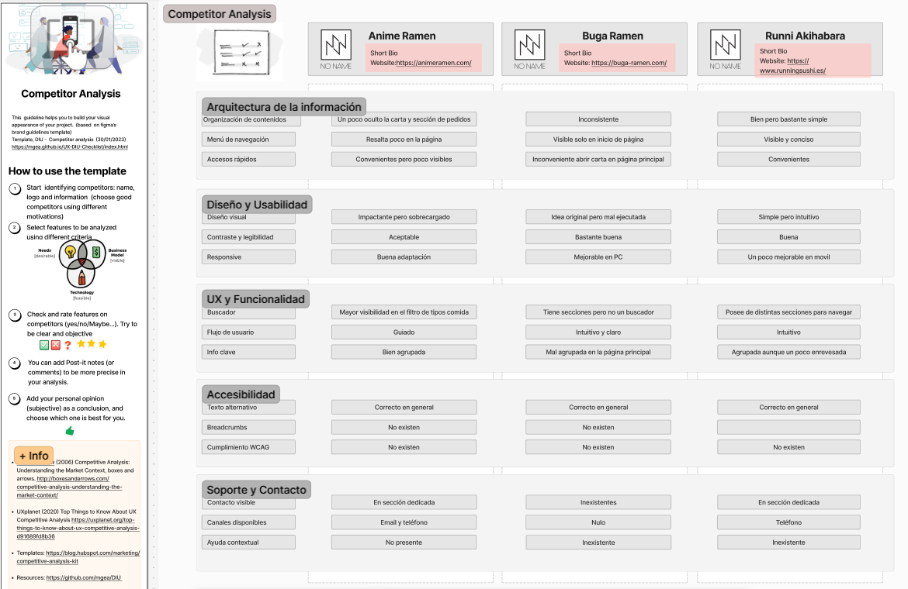
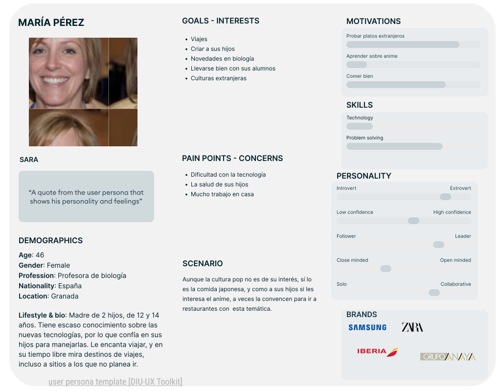
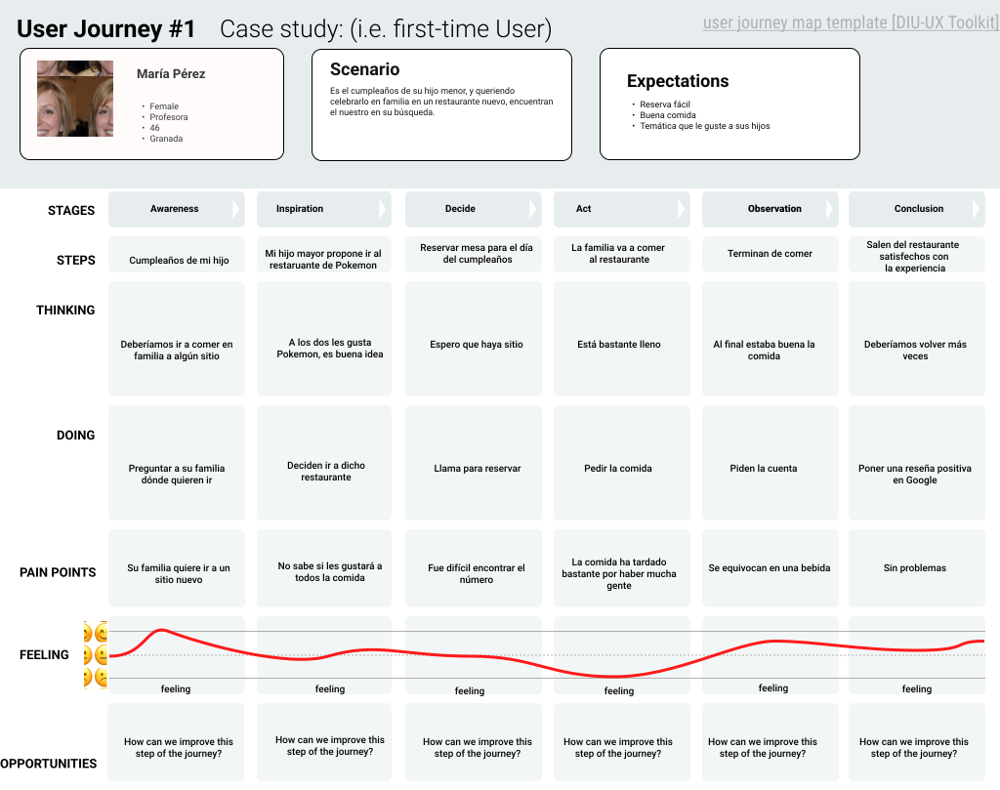

# DIU26
Prácticas Diseño Interfaces de Usuario (Tema: .... ) 

* [Guiones de prácticas](GuionesPracticas/)
* [Guía para crea tu Case Study](Guia_CaseStudy.md)
* Sala de la Fama [DIU Hall of fame](https://github.com/mgea/DIU/tree/master/hall_of_fame) donde se pueden encontrar Case Study destacados de otros años.

Actualizado: 14/01/2026

## Paso 0 My UX-Case Study
 
-----

Grupo: DIU1_Palillos.  Curso: 2025/26 

Nombre del Proyecto: 

El Poké de las cosas

Descripción: 

>>> Describa la idea de su producto en la práctica 2 

Logotipo: 

>>> Si diseña un logotipo para su producto en la práctica 3 pongalo aqui, a un tamaño adecuado. Si diseña un slogan añadalo aquí

Miembros y nombre del equipo:
 * :bust_in_silhouette:  Daniel Villalobos Rueda     :octocat:     
 * :bust_in_silhouette:  Álvaro Berenguer Cobo     :octocat:

>>> Los equipos son de 2 personas. Identifícaros con el nombre del Grupo y los enlaces a los perfiles de GitHub de cada integrante

----- 

 

# Proceso de Diseño 

En este proyecto nos vamos a centrar en el entorno de la restauración, concretamente en el ambito de los restaurantes japoneses ambientados en la cultura pop de Japón. Nuestro restaurante tendrá temática de Pokemon, con platos basados en especies y movimientos de la serie, y divididos según las regiones de su mundo. Como tal, la página web estará ambientada en dicha franquicia.

 

## Paso 1. UX User & Desk Research & Analisis 
### 1.a User Reseach Plan
---

 Con este analisis queremos comprender el tipo de clientela que podria estar interesada en etse tipo de comida. Para ello queremos comprender los intereses de la gente y también poder hacerlo atractivo hacia otro público que en un principio no estaba interesado.
Para ello vamos a crear una página web que nos permita llegar a más tipos de usuarios. 

### Objetivos

El objetivo principal de este estudio será, evidentemente aumentar las ventas del restaurante. Para ello, se intentarán alcanzar los siguientes objetivos menores:
- Que sea sencillo hacer una reserva.
- Que la carta sea fácil de encontrar.
- Que un posible cliente pueda saber rápidamente si tenemos un plato.
- Que quede claro los alérgenos de cada plato.

### Metodología

- Encuestas a los clientes, con preguntas demográficas, como su edad o género, y acerca de su experiencia con la web, como si se ha encontrado el plato que se buscaba.
- Métricas sobre el número de reservas respecto al número de visitas de la web.

### Perfil de los usuarios
Personas interesadas en la cultura y la comida japonesa. Probablemente jóvenes. También la familia de estas personas, que van a estar acompañados de esta persona joven.

### Tareas

- Reservar mesa.
- Ver horario.
- Consultar la carta y los menús, incluyendo alérgenos de los alimentos.
- Pedidos a domicilio.

### 1.b Competitive Analysis
-----

Hemos realizado un analisis competitivo de tres restaurantes japoneses de estetica anime de entre los cuales hemos tomado de referente el restaurante Anime Ramen puesto de ejemplo.
Como competidores hemos elegido los restaurantes Buga Ramen y  Runni Akihabara, que mantienen la misma estetica y hemos realizado un analisis de las páginas webs de cada uno de ellos.

Proyecto | Productos | Modelo de negocio | Usabilidad | Experiencia de compra | Estrategia de comunicación
--- | --- | --- | --- | --- | ---
Anime Ramen | Distintos platos japoneses, con una especializacón clara en el ramen como producto principal | Para disfrutar en el establecimiento o llevar a domicilio | Web simple que sirve para hacer reserva en los restaurantes y para realizar pedidos. Aunque podría mejorar la accesibilidad a la carta del restaurante | Puedes seleccionar entre distintos tipos de comida, pudiendo escoger a traves de un filtro el tipo de plato que deseas añadir a tu pedido. | Comunicación intuitiva en la mayoria de aspectos de la web 
Buga Ramen | Distintos platos japoneses | Para tomar en el establecimiento | Diseño sencillo aunque un poco enrevesado. Si quieres acceder a la carta desde la página principal, a través del enlace que no está en la cabecera, te remite a tu cuenta de google para poder visionar las imagenes de las hojas de la carta. Sin embargo, puedes desde la cabecera acceder a una pagina web más facil de navegar. | No se pueden realizar pedidos a través de la página web | Comunicación poco clara, se le da poco incapie a lo que realmente es importante (el producto).
Runni Akihabara | Distintos platos japoneses | Para tomar en el establecimiento | Web en la que puedes realizar reservas y ver la carta, aunque al ser una carta en formato pdf no tiene filtros que puedan ayudar a clasificar los distintos platos de comida | No se pueden realizar pedidos a través de la página web | Comunicación simple que proporciona el tipo de servicio de manera intuitiva

Como conclusión, el restaurante que posee una mejor página web con las mejores características o criterios es Anime Ramen.

### 1.c Personas
#### María Pérez

Madre de 2 hijos y profesora de biología, le gusta viajar y las culturas extranjeras, aunque no precisamente la cultura pop. Aunque no se lleva muy bien con los dispositivos inteligentes, confía en sus hijos cuando tiene problemas con ellos.

Como podemos observar a Mia le gustan tanto los videojuegos como el anime, características que pueden implicar que pueda estar interesada en nuestro restaurante PokePoké.

### 1.d User Journey Map
 
No poder reservar online ha sido un problema importante. Aún así, finalmente ha podido reservar por teléfono y disfrutar de la comida con su familia.

Aunque en un principio parecía haber estado interasada,
tras haber tardado en encontrar la carta y descubrir que el enlace a la parte de reservas te lleva a una página que te dice que el restaurante no acepta reservas online, decide abandonar la página del restaurante para buscar una mejor opción.

### 1.e Usability Review

Tras analizar el sitio web de la competencia, [animeramen](https://animeramen.com/), hemos obenido los siguientes puntos fuertes y débiles:
- Las secciones están claras y la página es fácil de navegar: tiene suficientemente pocas secciones como para caber todas en la cabecera, por lo que no hay pérdida para encontrar cualquier cosa. Sin embargo, la mayoría de ellas son parte de una misma página, lo que impide al usuario usar las funciones estándar del navegador para, por ejemplo, volver al inicio.
- En la página principal la cabecera es visible todo el tiempo, lo que permite ver en qué sección estás y desplazarte rápidamente a otra sección, pero la sección actual no destaca demasiado.
- La carta está bien organizada, según el tipo de comida, por lo que no es difícil encontrar un plato concreto, pero le falta una función de búsqueda que permita encontrarlo más rápidamente.
- Algo molesto en la carta, es que necesitas proporcionar los detalles de tu domicilio, o elegir un local (como si fueras a pedir a domicilio o a reservar mesa) para poder ver los detalles de los platos.
- Una cosa sin sentido es que hay un botón de reserva online para cada uno de los tres locales que tienen, cuando solo uno de ellos admite reservas online. Los otros dos conducen a un sitio que dice que no se admiten reservas online.

En conclusión, este sitio tiene algunos puntos fuertes, pero tiene otros mejorables, que es lo que aprovecharemos para hacer nuestro sitio web más agradable.

## Paso 2. UX Design  

>>> Cualquier título puede ser adaptado. Recuerda borrar estos comentarios del template en tu documento

### 2.a Reframing / IDEACION: Feedback Capture Grid / EMpathy map 
 
----

Para la ideación del proyecto hemos usado varias herramientas, como mapas de empatía, POVs y fun Feedback Capture Grid.

En el caso de los mapas de empatía hemos estudiado el comportamiento de los usuarios propuestos en la parte anterior de la práctica ante diferentes estimulos externos.
Después hemos analizado de manera generica los pros y contras obtenidos a través del analisis de los usuarios anteriores.
Por último, hemos analizado los puntos de vista del servicio orientados a plantear soluciones que respondan de manera efectiva a las necesidades detectadas en los usuarios.
### 2.b ScopeCanvas

----

En este apartado hemos desarrollado una plantilla, en la que se recolectan las necesidades y objetivos que tienen como principio el desarrollo de la página web del resturante. 
Además, se han definido las métricas clave que permitirán evaluar el rendimiento de la web, con el fin de comprobar si cumple adecuadamente con los objetivos planteados. 
>>> Propuesta de valor, pero ahora en vez de un texto es un ScopeCanvas que has subido a P2/ y enlazado desde aqui. Tambien vale una imagen miniatura del recurso.
>>> No olvides que tu propuesta ya tiene un nombre corto y puedes actualizar la cabecera de este archivo

### 2.b User Flow (task) analysis 
 
-----
En este apartado se han definido los flujos de usuario (User Flow) y los flujos de tareas (Task Flow), representando los pasos que sigue un usuario para completar acciones específicas dentro de la web.
Con este analisis del comportamiento del usuario, nos permite mejorar su experiencia.

>>> Definir "User Map" y "Task Flow" ... enlazar desde P2/ y describir brevemente

### 2.c IA: Sitemap + Labelling 
 
----
En este apartado hemos desarrollado un esquema con la estructura de páginas que va a tener nuestra web junto a las secciones correspondientes de cada página especifica.
Además hemos descrito cada una de estas secciones con términos claros y comprensibles para facilitar la interacción del usuario con la plataforma a través del labelling.
>>> Identificar términos para diálogo con usuario (evita el spanglish) y la arquitectura de la información. Es muy apropiado un diagrama tipo sitemap y una tabla que se ampliaría para llevar asociado la columna iconos (tanto para la web como para una app). 

Término | Significado     
| ------------- | -------
  Login  | acceder a plataforma

### 2.d Wireframes
 
-----

>>> Plantear el diseño del layout para Web/movil (organización y simulación). Describa la herramienta usada 
En esta sección hemos planteado los prottipos de las estructuras que van a tener las diferentes páginas de nuestra web y como se adaptan a los distintos tipos de dispositivos, en como se organiza la información al cambiar el tamaño de la pantalla.
La elaboración de los wireframes se ha realizado a través de Figma.
 

## Paso 3. Mi UX-Case Study (diseño)

>>> Cualquier título puede ser adaptado. Recuerda borrar estos comentarios del template en tu documento

### 3.a Moodboard

-----

>>> Diseño visual con una guía de estilos visual (moodboard) 
>>> Incluir Logotipo. Todos los recursos estarán subidos a la carpeta P3/
>>> Explique aqui la/s herramienta/s utilizada/s y el por qué de la resolución empleada. Reflexione ¿Se puede usar esta imagen como cabecera de Instagram, por ejemplo, o se necesitan otras?

### 3.b Landing Page
 
----

>>> Plantear el Landing Page del producto. Aplica estilos definidos en el moodboard

### 3.c Guidelines
 
----

>>> Estudio de Guidelines y explicación de los Patrones IU a usar 
>>> Es decir, tras documentarse, muestre las deciones tomadas sobre Patrones IU a usar para la fase siguiente de prototipado. 

### 3.d Mockup
 
----

>>> Consiste en tener un Layout en acción. Un Mockup es un prototipo HTML que permite simular tareas con estilo de IU seleccionado. Muy útil para compartir con stakeholders

 

## Paso 4. Pruebas de Evaluación 

### 4.a Reclutamiento de usuarios 

-----

>>> Breve descripción del caso asignado (llamado Caso-B) con enlace al repositorio Github
>>> Tabla y asignación de personas ficticias (o reales) a las pruebas. Exprese las ideas de posibles situaciones conflictivas de esa persona en las propuestas evaluadas. Mínimo 4 usuarios: asigne 2 al Caso A y 2 al caso B.

| Usuarios | Sexo/Edad     | Ocupación   |  Exp.TIC    | Personalidad | Plataforma | Caso
| ------------- | -------- | ----------- | ----------- | -----------  | ---------- | ----
| User1's name  | H / 18   | Estudiante  | Media       | Introvertido | Web.       | A 
| User2's name  | H / 18   | Estudiante  | Media       | Timido       | Web        | A 
| User3's name  | M / 35   | Abogado     | Baja        | Emocional    | móvil      | B 
| User4's name  | H / 18   | Estudiante  | Media       | Racional     | Web        | B 

### 4.b Diseño de las pruebas 
 
-----

>>> Planifique qué pruebas se van a desarrollar. ¿En qué consisten? ¿Se hará uso del checklist de la P1?

### 4.c Cuestionario SUS
 
----

>>> Como uno de los test para la prueba A/B testing, usaremos el **Cuestionario SUS** que permite valorar la satisfacción de cada usuario con el diseño utilizado (casos A o B). Para calcular la valoración numérica y la etiqueta linguistica resultante usamos la [hoja de cálculo](https://github.com/mgea/DIU19/blob/master/Cuestionario%20SUS%20DIU.xlsx). Previamente conozca en qué consiste la escala SUS y cómo se interpretan sus resultados
http://usabilitygeek.com/how-to-use-the-system-usability-scale-sus-to-evaluate-the-usability-of-your-website/)
Para más información, consultar aquí sobre la [metodología SUS](https://cui.unige.ch/isi/icle-wiki/_media/ipm:test-suschapt.pdf)
>>> Adjuntar en la carpeta P4/ el excel resultante y describa aquí la valoración personal de los resultados 

### 4.d A/B Testing
 
-----

>>> Los resultados de un A/B testing con 3 pruebas y 2 casos o alternativas daría como resultado una tabla de 3 filas y 2 columnas, además de un resultado agregado global. Especifique con claridad el resultado: qué caso es más usable, A o B?

### 4.e Aplicación del método Eye Tracking 

----

>>> Indica cómo se diseña el experimento y se reclutan los usuarios. Explica la herramienta / uso de gazerecorder.com u otra similar. Aplíquese únicamente al caso B.

  
>>> Cambiar esta img por una de vuestro experimento. El recurso deberá estar subido a la carpeta P4/  

>>> gazerecorder en versión de pruebas puede estar limitada a 3 usuarios para generar mapa de calor (crédito > 0 para que funcione) 

### 4.f Usability Report de B
 
-----

>>> Añadir report de usabilidad para práctica B (la de los compañeros) aportando resultados y valoración de cada debilidad de usabilidad. 
>>> Enlazar aqui con el archivo subido a P4/ que indica qué equipo evalua a qué otro equipo.

>>> Complementad el Case Study en su Paso 4 con una Valoración personal del equipo sobre esta tarea

 

## Paso 5. Exportación y Documentación 

### 5.a Exportación a HTML/React
 
----

>>> Breve descripción de esta tarea. Las evidencias de este paso quedan subidas a P5/

### 5.b Documentación con Storybook

----

>>> Breve descripción de esta tarea. Las evidencias de este paso quedan subidas a P5/

 

## Conclusiones finales & Valoración de las prácticas

>>> Opinión FINAL del proceso de desarrollo de diseño siguiendo metodología UX y valoración (positiva /negativa) de los resultados obtenidos. ¿Qué se puede mejorar? Recuerda que este tipo de texto se debe eliminar del template que se os proporciona
